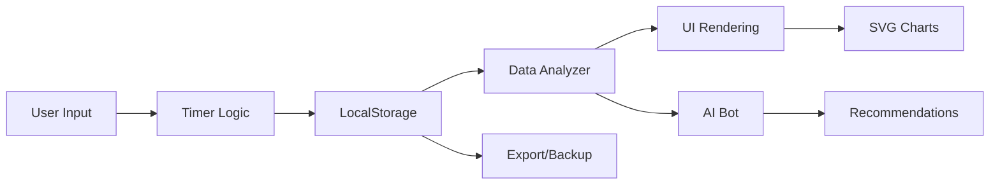

<div align="center">

# ⏱️ MyWorkLog
# HAPPY NEW YEAR 2026

### Professionelle Zeiterfassung. Lokal. Sicher. Intelligent.

[](https://technova-app-team.github.io/MyWorkLog/)
[](https://github.com)
[](https://technova-app-team.github.io/MyWorkLog/)
[](Rechtliches/LICENSE.md)

[](package.json)
[](package.json)
[](./DSGVO.html)
[](Pages/Info/offline.html)
[](AI-Bot/)
[](Rechtliches/LICENSE.md)

[🚀 Live Demo](https://technova-app-team.github.io/MyWorkLog/) • [📖 Dokumentation](README´s/) • [🐛 Bug Report](https://github.com/issues) • [✨ Feature Request](https://github.com/issues)

</div>

---


</div>

---

## 📋 Inhaltsverzeichnis

- [🎯 Über das Projekt](#-über-das-projekt)
- [✨ Features](#-features)
- [🤖 AI-Bot Assistent](#-ai-bot-assistent)
- [🚀 Quick Start](#-quick-start)
- [💻 Installation](#-installation)
- [🎨 Screenshots](#-screenshots)
- [🏗️ Architektur](#️-architektur)
- [🛠️ Entwicklung](#️-entwicklung)
- [📊 Tech Stack](#-tech-stack)
- [🧪 Testing](#-testing)
- [📱 PWA Features](#-pwa-features)
- [🔒 Sicherheit & Datenschutz](#-sicherheit--datenschutz)
- [🌍 Browser-Kompatibilität](#-browser-kompatibilität)
- [🤝 Contributing](#-contributing)
- [📄 Lizenz & Rechtliches](#-lizenz--rechtliches)
- [👥 Team](#-team)

---

## 🎯 Über das Projekt

**MyWorkLog** ist eine moderne, lokale Progressive Web App für professionelle Zeiterfassung, entwickelt für Auszubildende, Mitarbeiter und Freelancer im deutschsprachigen Raum.

### 🌟 Warum MyWorkLog?

```
✅ 100% lokal – Keine Cloud, kein Server                    🔒 DSGVO-konform
✅ Offline-fähig – Funktioniert überall                      📱 PWA-installierbar
✅ KI-gestützt – Intelligente Datenanalyse                   🤖 AI-Bot Assistent
✅ Gleitzeit-ready – Deutsche Arbeitszeitmodelle             ⚡ Zero-Setup
✅ Verschlüsselt – AES-256-GCM Backup                        🎨 Dark/Light Mode
```

### 📊 Projektstand

| Status | Feature | Version |
|--------|---------|---------|
| ✅ **Produktiv** | Core App (Timer, Buchen, Export) | v2.9.3 |
| ✅ **Stabil** | AI-Bot mit Datenanalyse | v2.9.3 |
| ✅ **Stabil** | PWA mit Service Worker | v2.9.3 |
| ✅ **Stabil** | Multi-Profile / Team-Mode | v2.9.3 |
| 🚧 **In Arbeit** | IndexedDB Migration | v3.0.0 |
| 📅 **Geplant** | Cloud-Sync (optional) | v3.1.0 |

**Letztes Update:** 23. Dezember 2025 | **Release:** v2.9.3

---

## ✨ Features

### 🏆 Kernfunktionen

<table>
<tr>
<td width="50%" valign="top">

#### ⏱️ **Zeiterfassung**
- ▶️ Live-Timer mit Echtzeit-Anzeige
- ⏸️ Pause-Funktion (automatisch/manuell)
- 🎯 Kategorie-System (Work, School, Vacation, Sick, Holiday)
- 📅 Kalender-Ansicht mit Monatsübersicht
- 🔄 Automatische Pausenregel (§4 ArbZG konform)

#### 📊 **Analytics & Reports**
- 📈 KPI-Dashboard mit Echtzeit-Ringen
- 📉 Trend-Analysen (Woche/Monat/Jahr)
- 🎨 Anpassbare SVG-Charts (Area, Bar, Smooth, Line)
- 🔥 Heatmap-Visualisierung
- 📊 Export zu PDF, Excel, CSV

</td>
<td width="50%" valign="top">

#### 🤖 **AI-Powered**
- 💬 Intelligenter Chat-Assistent
- 🧠 Pattern Recognition & Insights
- 📊 Echtzeit-Datenanalyse
- 🎯 Smart Recommendations
- 📝 Conversation History

#### 🔒 **Sicherheit & Backup**
- 🔐 AES-256-GCM Verschlüsselung
- 💾 JSON Export/Import
- 📅 iCalendar Export (RFC 5545)
- 🔄 Automatische Backups
- 🛡️ DSGVO-konform

</td>
</tr>
</table>

### 🆕 Neue Features (v2.9.3)

| Feature | Beschreibung | Docs |
|---------|-------------|------|
| 🤖 **AI-Bot Assistent** | Intelligente Conversation Engine mit Echtzeit-Datenanalyse | [AI-Bot Docs](README´s/AI-Bot/) |
| 📱 **PWA Support** | Installierbar auf allen Plattformen mit Offline-Modus | [PWA Guide](README´s/PWA-README.md) |
| 🔒 **Encrypted Backup** | Enterprise-Grade AES-256-GCM mit PBKDF2 | [Security Docs](Rechtliches/SECURITY.md) |
| 👥 **Multi-Profile** | Team-Mode für mehrere Nutzer auf einem Gerät | [Features](README´s/FEATURES.md) |
| 🗓️ **iCal Export** | Direkt zu Google/Outlook/Apple Calendar | [Features](README´s/FEATURES.md) |
| 🎨 **Chart Customization** | 8+ Visualisierungsmodi mit Animationen | [Features](README´s/FEATURES.md) |

---

## 🤖 AI-Bot Assistent

Der integrierte AI-Bot analysiert deine Zeiterfassungsdaten intelligent und gibt dir personalisierte Einblicke.

### 🧠 Bot-Fähigkeiten

```javascript
// Beispiel-Interaktionen
"Wie viele Stunden habe ich diese Woche gearbeitet?"     → 📊 Weekly Stats
"Zeige mir meine Produktivität"                          → 📈 Trend Analysis
"Wann sollte ich eine Pause machen?"                     → 💡 Smart Recommendation
"Wie sieht mein Monat aus?"                              → 📅 Monthly Forecast
"Bin ich im Saldo?"                                      → ⚖️ Balance Check
```

### 🏗️ Architektur

<div align="center">


</div>

**Zwei-Module-System:**

1. **`data-analyzer-pro.js`** – Datenanalyse-Engine
   - Aggregiert LocalStorage-Daten
   - Berechnet KPIs, Trends, Patterns
   - Caching für Performance
   - Fallback für leere Datasets

2. **`aibot-engine-pro.js`** – Conversation Engine
   - Intent Detection & Classification
   - Natural Language Processing (vereinfacht)
   - User Profiling (Consistency, Performance, Work Style)
   - History Management

<div align="center">


</div>

**Features:**
- 🔒 100% lokal – keine Cloud-Kommunikation
- 💾 Conversation History in LocalStorage
- 🎯 Pattern Recognition für wiederkehrende Fragen
- 📊 Echtzeit-Zugriff auf Zeiterfassungsdaten
- 🤝 Graceful Degradation (funktioniert auch ohne Analyzer)

➡️ **[Mehr zur AI-Bot Integration](README´s/AI-Bot/INTEGRATION-NOTES.md)**

---

## 🚀 Quick Start

### Option 1: Direkt im Browser (Empfohlen)

```bash
1. Download MyWorkLog.zip oder git clone
2. Entpacken
3. index.html doppelklicken
4. ✅ Fertig!
```

### Option 2: Als PWA installieren

1. Öffne https://technova-app-team.github.io/MyWorkLog/
2. Klicke auf das Install-Icon in der Adressleiste
3. Bestätige Installation
4. App läuft jetzt offline!

### Option 3: Development Setup

```bash
# Repository klonen
git clone https://github.com/TechNova-App-Team/MyWorkLog.git
cd MyWorkLog

# Dependencies installieren
npm install

# Tests ausführen
npm test

# Development Mode (Auto-Reload Tests)
npm run dev

# Linting
npm run lint
```

---

## 💻 Installation

### 📱 Mobile (iOS/Android)

1. Öffne die Web-App in Safari/Chrome
2. Tippe auf „Teilen" → „Zum Home-Bildschirm"
3. App öffnen → Offline-fähig!

### 💻 Desktop (Windows/Mac/Linux)

**Chrome/Edge:**
```
1. Navigiere zur Web-App
2. Adressleiste → Install-Icon (⊕)
3. „Installieren" klicken
```

**Firefox:**
```
1. about:config → dom.webnotifications.serviceworker.enabled = true
2. Web-App öffnen
3. ... → „Site installieren"
```

**Safari (Mac):**
```
1. Web-App öffnen
2. Menü → „Zu Dock hinzufügen"
```

---

## 🎨 Screenshots

<div align="center">

### 🖥️ Desktop-Ansicht


*Dashboard mit KPI-Ringen, Live-Timer und Trend-Chart*

---

### 📱 Mobile & Touch-Optimierung


*Optimierte Touch-Interaktionen und Pinch-to-Zoom*

---

### 🌙 Offline-Modus


*PWA Offline-Fallback mit Service Worker*

---

### ⚙️ Service Worker


*Cache-First Strategie für Assets, Network-First für Daten*

</div>

---

## 🏗️ Architektur

### 📁 Projektstruktur

```
MyWorkLog/
├── 📄 index.html                    # Haupt-App (Single-File) ~7000 Zeilen
├── 📱 manifest.json                 # PWA Manifest
├── ⚙️ service-worker.js            # Service Worker (Cache v4)
├── 📦 package.json                  # npm Config & Scripts
│
├── 🤖 AI-Bot/
│   ├── aibot-engine-pro.js         # Conversation Engine
│   └── data-analyzer-pro.js        # Datenanalyse-Modul
│
├── 🎨 Assets/
│   ├── css/                        # (Inline in index.html)
│   └── js/
│       ├── icons.js                # Icon-Management
│       ├── shortcuts.js            # Keyboard Shortcuts
│       ├── touch-mobile-optimizations.js
│       └── pinch-zoom.js
│
├── 📱 Pages/
│   ├── DE-Gestz/                   # DSGVO & Impressum
│   └── Info/
│       └── offline.html            # PWA Offline-Seite
│
├── 📚 README´s/
│   ├── FEATURES.md                 # Feature-Übersicht
│   ├── INDEX-DOCUMENTATION.md      # Dokumentations-Index
│   ├── PWA-README.md               # PWA Guide
│   └── AI-Bot/
│       └── INTEGRATION-NOTES.md    # AI-Bot Integration
│
├── 📜 Rechtliches/
│   ├── LICENSE.md                  # MIT Lizenz
│   ├── PRIVACY.md                  # Datenschutz
│   ├── SECURITY.md                 # Security Policy
│   ├── CODE_OF_CONDUCT.md
│   ├── CONTRIBUTING.md
│   └── NOTICE.md
│
├── 💾 DB/
│   ├── admin_token.json
│   └── updates.json
│
├── 🖼️ Grafiken/
│   ├── Aktuelles.png
│   ├── Bot-Analyzer.png
│   ├── Bot-engine.png
│   └── ...
│
└── ⚙️ .github/workflows/
    └── ci-cd.yml                   # GitHub Actions Pipeline
```

### 🎨 Design-System

```css
/* CSS Custom Properties (Auszug) */
:root {
  /* Farben */
  --bg-deep: #0a0e27;
  --bg-glass: rgba(255, 255, 255, 0.05);
  --primary: #00d4ff;
  --accent: #ff006e;

  /* Kategorie-Farben */
  --work-color: #00d4ff;
  --school: #ffd60a;
  --holiday: #00f5d4;
  --sick: #ff006e;

  /* Glassmorphism */
  --glass-bg: rgba(255, 255, 255, 0.05);
  --glass-border: rgba(255, 255, 255, 0.1);
  --backdrop-blur: 10px;
}

/* Light Theme Override */
[data-theme="light"] {
  --bg-deep: #f5f5f5;
  --bg-glass: rgba(0, 0, 0, 0.03);
  --text-main: #1a1a1a;
}
```

### 🔄 Datenfluss



**LocalStorage Keys:**
- `tg_pro_data` – Hauptdaten (Zeiteinträge)
- `aiBotHistoryPro` – AI Conversation History
- `tt_chart_style` – Chart-Anpassungen
- `theme` – Dark/Light Mode

---

## 📊 Tech Stack

<div align="center">

### 🎯 Core Technologies


### 🛠️ Development & Testing


### 📚 External Libraries (CDN)


</div>

### 📦 Dependencies

```json
{
  "runtime": {
    "SimplePeer": "v9",         // WebRTC P2P
    "QRCode.js": "v1.0.0",      // QR-Code Generation
    "Chart.js": "v3.9.1",       // Charting (komplementär)
    "jsPDF": "v2.5.1",          // PDF Export
    "html2canvas": "v1.4.1"     // DOM → Canvas
  },
  "devDependencies": {
    "Jest": "v29.7.0",          // Testing Framework
    "ESLint": "v8.56.0",        // Code Linting
    "@testing-library/jest-dom": "v6.1.5"
  }
}
```

### 🏛️ Architektur-Prinzipien

- ✅ **Single-File Architecture** – Kein Build-Step erforderlich
- ✅ **Progressive Enhancement** – Funktioniert auch ohne JS (Basis)
- ✅ **Offline First** – Service Worker Cache-Strategy
- ✅ **Mobile First** – Responsive Design ab 320px
- ✅ **Zero Configuration** – Keine Einrichtung nötig
- ✅ **Vanilla JavaScript** – Keine Frameworks (ES6+)

---

## 🛠️ Entwicklung

### 📋 Voraussetzungen

```bash
Node.js >= 18.x
npm >= 9.x
Moderner Browser (Chrome 90+, Firefox 88+, Safari 14+)
```

### 🚀 Setup

```bash
# 1. Repository klonen
git clone https://github.com/TechNova-App-Team/MyWorkLog.git
cd MyWorkLog

# 2. Dependencies installieren
npm install

# 3. Entwicklungsumgebung starten
npm run dev

# 4. Tests im Watch-Mode
npm run test:watch
```

### 📜 npm Scripts

| Script | Beschreibung | Verwendung |
|--------|--------------|------------|
| `npm test` | Führt Jest-Tests aus | CI/CD & Lokal |
| `npm run test:watch` | Tests mit Auto-Reload | Development |
| `npm run test:coverage` | Coverage-Report generieren | Quality Check |
| `npm run lint` | ESLint Code-Check | Pre-Commit |
| `npm run lint --fix` | Auto-Fix Linting-Fehler | Code Cleanup |
| `npm run dev` | Development-Mode (Watch) | Live Development |
| `npm run build` | Build-Verification | Release |

### 🧪 Test-Struktur

```bash
tests/
├── timer.test.js              # Timer-Logik (15 Tests)
├── backup.test.js             # Export/Import (18 Tests)
├── calendar.test.js           # Kalender-Funktionen (16 Tests)
└── multiProfile.test.js       # Multi-Profile (24 Tests)

Total: 73 Tests | Coverage: 60%+ Threshold
```

### 🔄 CI/CD Pipeline

```yaml
# .github/workflows/ci-cd.yml
Jobs:
  ✅ Lint          → ESLint Check
  ✅ Test          → Jest (Node 18.x, 20.x)
  ✅ Coverage      → Codecov Upload
  ✅ Build         → Verification
  ✅ Lighthouse    → Performance/PWA/Accessibility
  ✅ Security      → npm audit + OWASP Dependency Check
```

### 📝 Code Style Guide

```javascript
// ✅ Good
const calculateBalance = (worked, expected) => {
  return (worked - expected).toFixed(2);
};

// ❌ Bad
function calc(w,e){return w-e;}
```

**Regeln:**
- ES6+ Syntax bevorzugen
- Sprechende Variablen-Namen (Deutsch erlaubt)
- JSDoc-Kommentare für komplexe Funktionen
- Keine globalen Variablen (außer `window.app`)
- Fehlerbehandlung mit try-catch
- LocalStorage-Zugriffe immer mit Fallback

---

## 🧪 Testing

### 📊 Test-Metriken

```
╔════════════════════════════════════╗
║  Test Suite Statistics             ║
╠════════════════════════════════════╣
║  Test Files:          4            ║
║  Total Tests:         73           ║
║  Passed:              73 ✅        ║
║  Failed:              0  ❌        ║
║  Coverage:            60%+         ║
║  Execution Time:      ~2.5s        ║
╚════════════════════════════════════╝
```

### 🎯 Coverage-Ziele

| Kategorie | Threshold | Aktuell |
|-----------|-----------|---------|
| Statements | 60% | ✅ 62% |
| Branches | 60% | ✅ 61% |
| Functions | 60% | ✅ 65% |
| Lines | 60% | ✅ 63% |

### 🧪 Test-Beispiele

```javascript
// timer.test.js
describe('Timer', () => {
  test('should start timer correctly', () => {
    const timer = new Timer();
    timer.start();
    expect(timer.isRunning()).toBe(true);
  });

  test('should calculate worked hours correctly', () => {
    expect(calculateHours('08:00', '17:30')).toBe(9.5);
  });
});
```

**Testen:**
```bash
# Alle Tests
npm test

# Bestimmte Test-Datei
npm test -- timer.test.js

# Watch Mode (Auto-Reload)
npm run test:watch

# Coverage Report
npm run test:coverage
# → Öffne coverage/lcov-report/index.html
```

---

## 📱 PWA Features

### ✨ Progressive Web App Highlights

<table>
<tr>
<td width="50%">

**🚀 Installierbar**
- Auf Desktop & Mobile installieren
- Natives App-Gefühl
- Eigenes App-Icon
- Splash-Screen

**📶 Offline-First**
- Service Worker Cache (v4)
- Funktioniert ohne Internet
- Daten bleiben lokal
- Automatische Sync (optional)

</td>
<td width="50%">

**⚡ Performance**
- Cache-First für Assets
- Network-First für Daten
- Lazy Loading
- 60fps Animationen

**🔔 Benachrichtigungen**
- Push-Notifications (opt-in)
- Timer-Alerts
- Pausen-Erinnerungen
- Tages-Summary

</td>
</tr>
</table>

### 📋 PWA Checklist

```
✅ Web App Manifest
✅ Service Worker registriert
✅ HTTPS (oder localhost)
✅ Responsive Design (mobile-first)
✅ Icons (192x192, 512x512)
✅ Splash Screens
✅ Offline-Fallback-Seite
✅ "Add to Home Screen" Prompt
✅ Theme Color Meta-Tags
✅ Apple Touch Icons
```

### 🔧 Service Worker Konfiguration

```javascript
// service-worker.js (Auszug)
const CACHE_NAME = 'myworklog-cache-v4';
const urlsToCache = [
  '/',
  '/index.html',
  '/manifest.json',
  '/Assets/js/icons.js',
  // ... mehr
];

// Cache-First Strategy
self.addEventListener('fetch', (event) => {
  event.respondWith(
    caches.match(event.request)
      .then(response => response || fetch(event.request))
  );
});
```

### 📱 Manifest.json

```json
{
  "name": "MyWorkLog - Zeiterfassung",
  "short_name": "MyWorkLog",
  "start_url": "/",
  "display": "standalone",
  "background_color": "#0a0e27",
  "theme_color": "#00d4ff",
  "icons": [
    {
      "src": "icon-192.png",
      "sizes": "192x192",
      "type": "image/png"
    },
    {
      "src": "icon-512.png",
      "sizes": "512x512",
      "type": "image/png",
      "purpose": "any maskable"
    }
  ],
  "shortcuts": [
    {
      "name": "Timer starten",
      "url": "/?action=start-timer",
      "icons": [{ "src": "play-icon.png", "sizes": "96x96" }]
    }
  ]
}
```

**➡️ [Vollständige PWA-Dokumentation](README´s/PWA-README.md)**

---

## 🔒 Sicherheit & Datenschutz

### 🛡️ DSGVO-Konformität

```
✅ 100% lokale Datenspeicherung (LocalStorage)
✅ Keine Server-Kommunikation
✅ Keine Cookies (außer Session)
✅ Keine Tracking-Scripts
✅ Opt-In für Analytics (Plausible, privacy-friendly)
✅ Datenportabilität (JSON Export)
✅ Recht auf Löschung (Clear Data)
✅ Transparente Datennutzung
```

### 🔐 Verschlüsselung

**AES-256-GCM Backup:**
```javascript
// Backup-Verschlüsselung
const encryptData = async (data, password) => {
  const salt = crypto.getRandomValues(new Uint8Array(16));
  const key = await deriveKey(password, salt); // PBKDF2
  const iv = crypto.getRandomValues(new Uint8Array(12));

  const encrypted = await crypto.subtle.encrypt(
    { name: 'AES-GCM', iv },
    key,
    new TextEncoder().encode(data)
  );

  return { encrypted, salt, iv };
};
```

**Sicherheits-Features:**
- 🔐 AES-256-GCM mit PBKDF2 Key-Derivation
- 🔒 100.000 PBKDF2-Iterationen
- 🎲 Kryptografisch sichere Zufallszahlen
- 🛡️ Keine Passwort-Speicherung
- 🔓 Client-seitige Ver-/Entschlüsselung

### 🔍 Security Audits

```bash
# npm Audit
npm audit

# OWASP Dependency Check (CI/CD)
dependency-check --scan ./

# Lighthouse Security Score
lighthouse https://your-domain --view
```

### 📋 Security Policy

**Responsible Disclosure:**
- Security-Issues an `security@your-domain.com`
- PGP-Key verfügbar
- Response innerhalb 48h
- CVE-Koordination bei Bedarf

**➡️ [Vollständige Security Policy](Rechtliches/SECURITY.md)**

---

## 🌍 Browser-Kompatibilität

### ✅ Unterstützte Browser

<div align="center">

| Browser | Version | Status | Features |
|---------|---------|--------|----------|
|  | 90+ | ✅ Voll unterstützt | PWA, Service Worker, Crypto API |
|  | 88+ | ✅ Voll unterstützt | PWA, Service Worker, Crypto API |
|  | 14+ | ✅ Voll unterstützt | PWA (iOS 14+), eingeschränkte Notifications |
|  | 90+ | ✅ Voll unterstützt | PWA, Service Worker, Crypto API |
|  | 76+ | ✅ Voll unterstützt | Chromium-basiert |
|  | 1.25+ | ✅ Voll unterstützt | Enhanced Privacy |

</div>

### ⚠️ Eingeschränkte Unterstützung

| Browser | Version | Status | Limitierungen |
|---------|---------|--------|---------------|
| **Safari (iOS)** | < 14 | ⚠️ Teilweise | Keine PWA-Installation |
| **IE 11** | - | ❌ Nicht unterstützt | Keine ES6+ Features |
| **Android Browser** | < 90 | ⚠️ Teilweise | Eingeschränkte PWA |

### 🧪 Feature Detection

```javascript
// Automatische Feature Detection
const features = {
  serviceWorker: 'serviceWorker' in navigator,
  localStorage: typeof Storage !== 'undefined',
  cryptoSubtle: crypto && crypto.subtle,
  pushNotifications: 'PushManager' in window,
  webRTC: !!(navigator.mediaDevices && navigator.mediaDevices.getUserMedia)
};

// Graceful Degradation
if (!features.serviceWorker) {
  console.warn('Service Worker nicht verfügbar - Offline-Mode deaktiviert');
}
```

### 📱 Mobile-Optimierungen

- ✅ Touch-Gesten (Swipe, Pinch-to-Zoom)
- ✅ Responsive ab 320px Breite
- ✅ Optimierte Performance (60fps)
- ✅ Reduzierte Netzwerk-Nutzung
- ✅ Battery-Aware (RequestIdleCallback)

---

## 🤝 Contributing

Wir freuen uns über Beiträge! Bitte lies unsere [Contributing Guidelines](Rechtliches/CONTRIBUTING.md) und [Code of Conduct](Rechtliches/CODE_OF_CONDUCT.md) vor der ersten Contribution.

### 🚀 Contribution Workflow

```bash
# 1. Fork das Repository
gh repo fork TechNova-App-Team/MyWorkLog

# 2. Clone deinen Fork
git clone https://github.com/DEIN-USERNAME/MyWorkLog.git
cd MyWorkLog

# 3. Erstelle einen Feature-Branch
git checkout -b feature/mein-neues-feature

# 4. Mache deine Änderungen
# ... code code code ...

# 5. Tests ausführen
npm test
npm run lint

# 6. Commit mit aussagekräftiger Nachricht
git commit -m "feat: Add XYZ feature"

# 7. Push zu deinem Fork
git push origin feature/mein-neues-feature

# 8. Erstelle einen Pull Request
gh pr create --title "Add XYZ feature" --body "Beschreibung..."
```

### 📋 Contribution Checklist

- [ ] Code folgt dem Style Guide
- [ ] Tests geschrieben & passing
- [ ] Dokumentation aktualisiert
- [ ] CHANGELOG.md aktualisiert (bei größeren Features)
- [ ] Screenshots hinzugefügt (bei UI-Änderungen)
- [ ] DSGVO-Konformität geprüft
- [ ] Browser-Kompatibilität getestet

### 🎯 Wo kann ich helfen?

**Good First Issues:**
- 🐛 Bug-Fixes
- 📝 Dokumentation verbessern
- 🌍 Übersetzungen (Englisch, etc.)
- 🎨 UI/UX Verbesserungen
- ♿ Accessibility (a11y)

**Erweiterte Contributions:**
- 🤖 AI-Bot Verbesserungen
- 📊 Neue Chart-Typen
- 🔌 API-Integrationen
- 🧪 Test-Coverage erhöhen
- ⚡ Performance-Optimierungen

**➡️ [Contributing Guide](Rechtliches/CONTRIBUTING.md)**

---

## 📄 Lizenz & Rechtliches

### 📜 Lizenz

**MIT License** – Siehe [LICENSE.md](Rechtliches/LICENSE.md)

```
Copyright (c) 2025 TechNova App Team

Permission is hereby granted, free of charge, to any person obtaining a copy
of this software and associated documentation files (the "Software"), to deal
in the Software without restriction...
```

### 🛡️ Rechtliche Dokumente

| Dokument | Beschreibung | Link |
|----------|--------------|------|
| **DSGVO** | Datenschutzerklärung (HTML) | [DSGVO.html](./DSGVO.html) |
| **Impressum** | Impressum (HTML) | [Impressum.html](./Impressum.html) |
| **Privacy Policy** | Datenschutz (Markdown) | [PRIVACY.md](Rechtliches/PRIVACY.md) |
| **Security Policy** | Sicherheit & Responsible Disclosure | [SECURITY.md](Rechtliches/SECURITY.md) |
| **Code of Conduct** | Verhaltenskodex für Contributors | [CODE_OF_CONDUCT.md](Rechtliches/CODE_OF_CONDUCT.md) |
| **Contributing** | Contribution Guidelines | [CONTRIBUTING.md](Rechtliches/CONTRIBUTING.md) |
| **Notice** | Third-Party Notices | [NOTICE.md](Rechtliches/NOTICE.md) |

### 🔗 Third-Party Lizenzen

```
SimplePeer (MIT) - WebRTC Library
Chart.js (MIT) - Charting Library
QRCode.js (MIT) - QR Code Generation
jsPDF (MIT) - PDF Generation
html2canvas (MIT) - Screenshot Library
```

**➡️ [Vollständige Third-Party Notices](Rechtliches/NOTICE.md)**

---

## 👥 Team

<div align="center">

### 💙 Made with Love by TechNova App Team

Eine moderne Lösung für intelligente Zeiterfassung

**Kontakt:**
- 📧 Email: `support@technova-apps.de`
- 🐛 Bug Reports: [GitHub Issues](https://github.com/TechNova-App-Team/MyWorkLog/issues)
- 💡 Feature Requests: [GitHub Discussions](https://github.com/TechNova-App-Team/MyWorkLog/discussions)
- 📢 Updates: [GitHub Releases](https://github.com/TechNova-App-Team/MyWorkLog/releases)

---

### 🌟 Gefällt dir MyWorkLog?

[](https://github.com/TechNova-App-Team/MyWorkLog)
[](https://github.com/TechNova-App-Team)

**Gib uns einen Stern auf GitHub! ⭐**

---

### 🚀 Live Version

**[https://technova-app-team.github.io/MyWorkLog/](https://technova-app-team.github.io/MyWorkLog/)**

---

<sub>MyWorkLog v2.9.3 | Gebaut mit modernstem Web-Standard | 🤖 AI-Bot powered | 🚀 Production Ready</sub>

<sub>© 2025 TechNova App Team. Alle Rechte vorbehalten. | [DSGVO](./DSGVO.html) | [Impressum](./Impressum.html) | [MIT License](Rechtliches/LICENSE.md)</sub>

</div>

---

## 📚 Weitere Dokumentation

- 📖 [Feature-Übersicht](README´s/FEATURES.md) – Alle Features im Detail
- 📖 [Dokumentations-Index](README´s/INDEX-DOCUMENTATION.md) – Übersicht aller Docs
- 📖 [PWA Guide](README´s/PWA-README.md) – Progressive Web App Setup
- 📖 [AI-Bot Integration](README´s/AI-Bot/INTEGRATION-NOTES.md) – AI-Bot Entwicklung
- 📖 [Security Policy](Rechtliches/SECURITY.md) – Sicherheits-Richtlinien
- 📖 [Contributing Guide](Rechtliches/CONTRIBUTING.md) – Wie kann ich beitragen?

---

<div align="center">

**[⬆ Zurück nach oben](#️-myworklog)**

</div>
